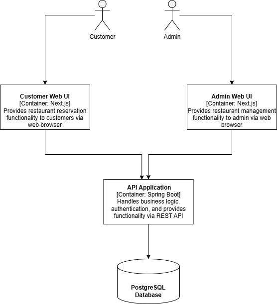
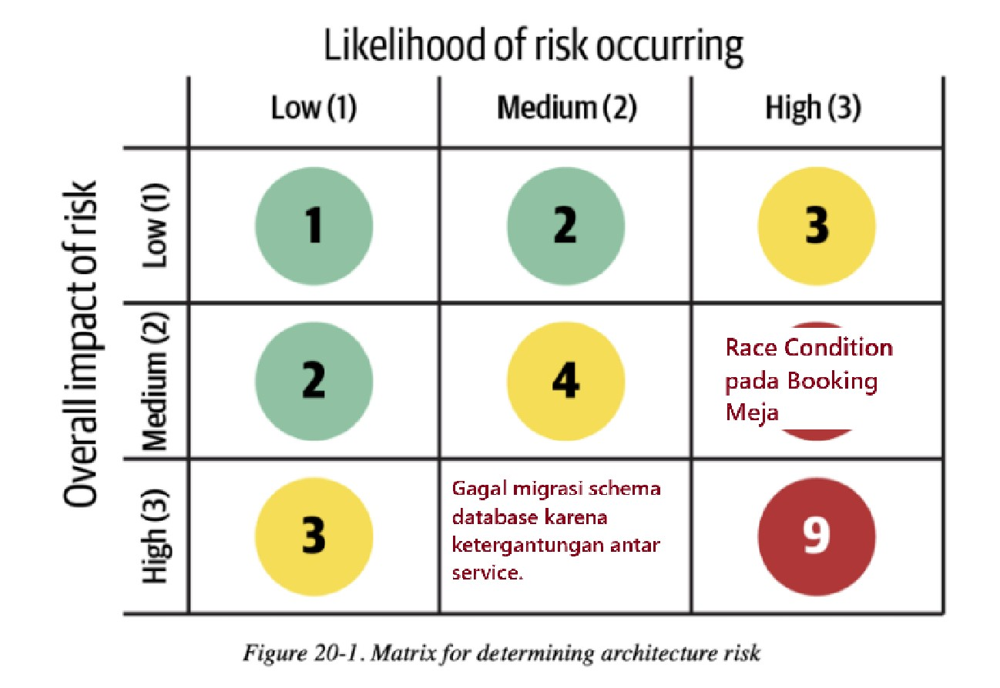
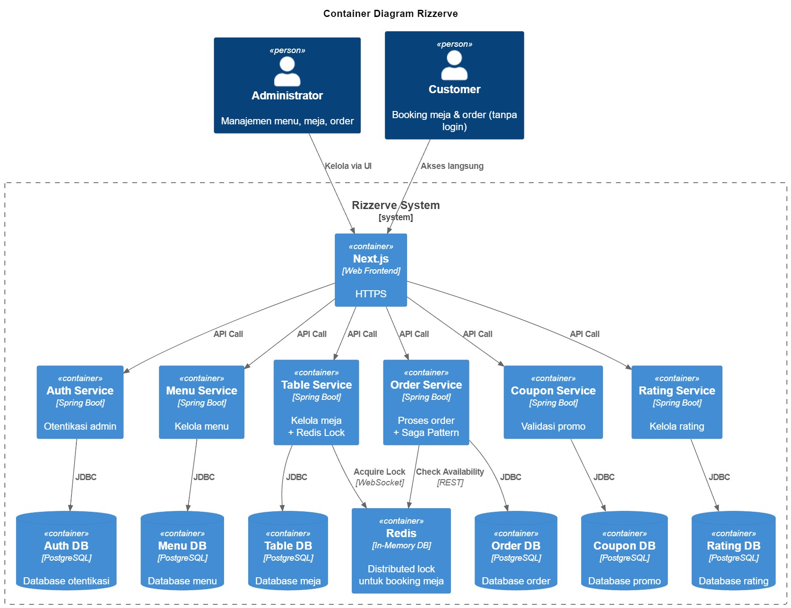
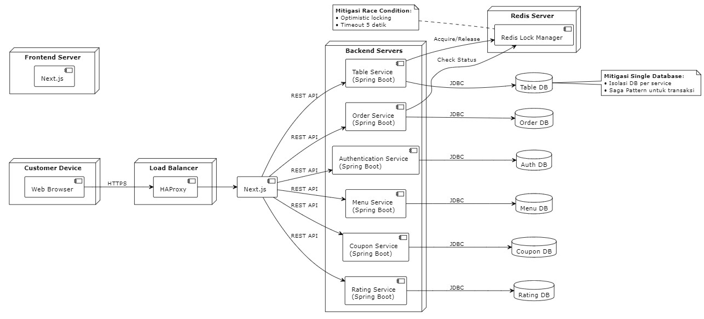

# Software Architecture A17 - Rizzerve

## Initial Architecture Diagram
- **Context Diagram**

- **Container Diagram**

- **Deployment Diagram**

---

## Risk Storming - Future Architecture
- **Architecture Risk Matrix**

- **Future Context Diagram**

- **Future Container Diagram**

- **Future Deployment Diagram**

## Consenssus
Setelah diskusi tim, disepakati bahwa dua risiko berikut memiliki skor tertinggi (6) dan menjadi prioritas mitigasi:
1. Single Database untuk Multi-Service
    * Kesepakatan Tim:
        * Semua partisipan setuju bahwa penggunaan satu database bersama oleh multi-service berpotensi menyebabkan:
            * Masalah migrasi schema (contoh: perubahan tabel oleh satu service mengganggu service lain).
            * Bottleneck performa saat beban tinggi.
    * Meskipun kemungkinan terjadi medium (karena saat ini masih dalam pengembangan), tetapi dampaknya high (dapat mengganggu seluruh operasi).

* Race Condition pada Booking Meja
    * Kesepakatan Tim:
        * Partisipan sepakat bahwa meja yang dipesan bersamaan oleh banyak customer (tanpa mekanisme locking) akan menyebabkan:
            * Double booking (satu meja terisi oleh lebih dari satu customer).
            * Pengalaman pengguna buruk (konflik saat checkout).
        * Kemungkinan terjadi high (karena akses concurrent), dampak medium (dapat diperbaiki dengan rollback, tetapi reputasi restoran terdampak).

## Mitigation
1. Mitigasi untuk Single Database Multi-Service
    * Solusi: Pisahkan database per microservice (isolasi database).
    * Kelebihan:
        - Migrasi Schema Lebih Aman: Perubahan schema di satu service tidak memengaruhi service lain.
        - Performa Lebih Baik: Menghindari bottleneck saat beban tinggi karena query terdistribusi.
        - Keamanan Meningkat: Jika satu database diretas, service lain tetap aman.
    * Kekurangan:
        - Biaya Operasional Naik: Butuh lebih banyak sumber daya untuk manage multiple database.
        - Kompleksitas Transaksi: Transaksi antar service memerlukan event-driven architecture (misal: Kafka).
        - Data Duplikasi: Beberapa data perlu direplikasi (contoh: info menu di Order Service dan Menu Service).
2. Mitigasi untuk Race Condition pada Booking Meja
    * Solusi: Implementasi optimistic locking dengan versioning atau distributed lock (Redis).
    * Kelebihan:
        - Mencegah Double Booking: Hanya satu customer yang bisa membooking meja dalam waktu bersamaan.
        - Responsif: Tidak mengunci seluruh sistem (hanya row/meja yang diproses).
        - Scalable: Cocok untuk arsitektur microservice.
    * Kekurangan:
        - Overhead Teknis: Butuh tambahan kode untuk handle conflict (contoh: retry mechanism).
        - Latency: Jika pakai Redis, tambahan jaringan untuk acquire/release lock.
        - Fallback Complex: Jika lock gagal, perlu mekanisme rollback (misal: notifikasi "meja sudah terisi").

## Justifikasi
Kami memilih teknik risk storming karena cara ini membuat semua anggota tim bicara tentang kemungkinan masalah sejak awal. Setiap orang memberi ide tentang apa yang bisa salah dan apa akibatnya. Setelah itu, kami menilai mana yang paling penting berdasarkan seberapa sering bisa terjadi dan seberapa besar gangguannya.

Untuk resiko “Satu Database untuk Banyak Layanan”, kami lihat bahwa memakai satu database memang cepat saat mulai, tapi bisa jadi titik gagal tunggal. Jika satu layanan mengubah skema, layanan lain bisa rusak. Saat trafik tinggi, database itu bisa kewalahan. Solusinya adalah pisahkan database untuk tiap layanan. Dengan begitu, perubahan skema di satu layanan tidak mengganggu yang lain, kapasitas bisa ditambah sesuai kebutuhan, dan sistem lebih mudah dipulihkan jika terjadi masalah.

Pada resiko “Bentrokan Saat Booking Meja”, banyak pengguna bisa pesan meja bersamaan dan menyebabkan double booking. Kami sepakat menggunakan optimistic locking atau kunci terdistribusi lewat Redis. Cara ini hanya mengunci data yang sedang diproses, bukan seluruh tabel. Jika ada dua permintaan bentrok, satu akan gagal dan dicoba ulang. Dengan begitu, meja tidak bisa dipakai dua kali dan pengalaman pengguna tetap mulus.